# Pay-Gateway 支付网关架构文档

## 1. 概述

**Pay-Gateway** 是一个基于 Go 语言实现的统一支付网关服务，提供 **gRPC** 和 **HTTP REST API** 两种接口方式。该服务封装了多种支付方式的实现细节，为业务系统提供统一的支付接口，支持微信支付、抖音支付、快手支付、支付宝等多种支付方式。

**与 Pay-Gateway-RPC 的区别**：
- Pay-Gateway 提供 **gRPC + HTTP API** 双协议支持
- Pay-Gateway 的 HTTP API 主要用于接收第三方支付平台的回调通知
- Pay-Gateway 支持完整的抖音周期代扣订单管理（`pm_dy_period_order` 表）
- Pay-Gateway 提供更丰富的内部管理接口和定时任务接口

**技术栈**：
- 语言：Go
- 框架：go-zero
- 通信协议：gRPC + HTTP REST
- 数据库：MySQL
- 配置管理：Nacos

## 2. 系统架构

### 2.1 整体架构图

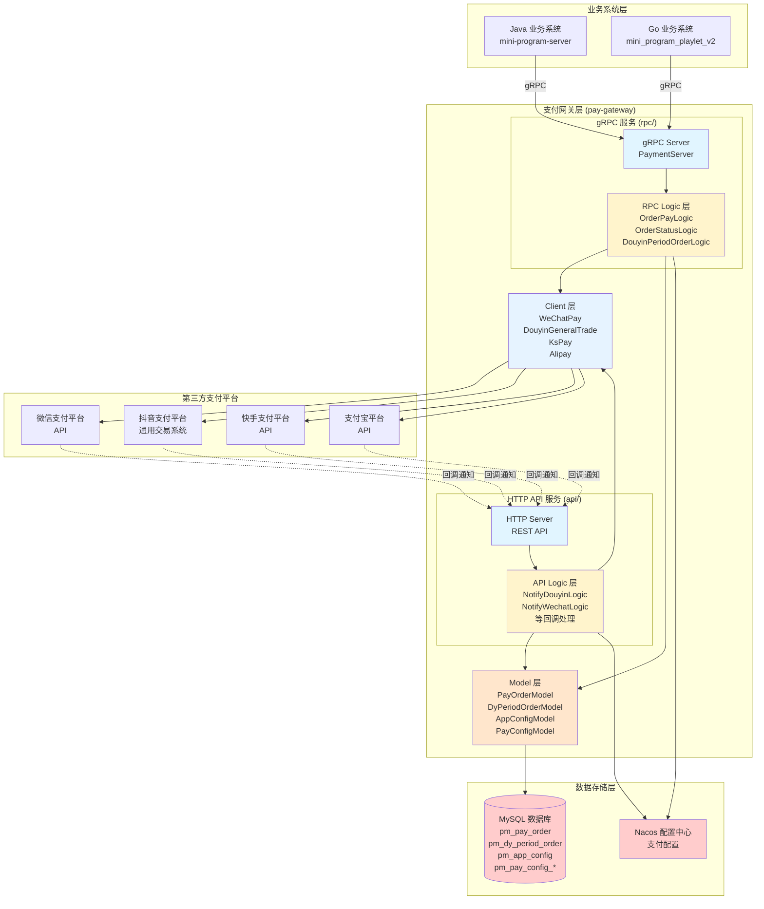

### 2.2 分层架构

```mermaid
graph TD
    subgraph "接口层"
        GrpcServer[gRPC Server<br/>PaymentServer]
        HttpServer[HTTP Server<br/>REST API]
    end
    
    subgraph "业务逻辑层"
        subgraph "RPC Logic"
            OrderPayLogic[OrderPayLogic<br/>创建支付订单]
            OrderStatusLogic[OrderStatusLogic<br/>查询订单状态]
            DouyinPeriodOrderLogic[DouyinPeriodOrderLogic<br/>周期代扣管理]
        end
        
        subgraph "API Logic"
            NotifyDouyinLogic[NotifyDouyinLogic<br/>抖音回调处理]
            NotifyWechatLogic[NotifyWechatLogic<br/>微信回调处理]
            NotifyKsLogic[NotifyKsLogic<br/>快手回调处理]
            NotifyAlipayLogic[NotifyAlipayLogic<br/>支付宝回调处理]
        end
    end
    
    subgraph "支付客户端层"
        WeChatClient[WeChatPay<br/>微信支付客户端]
        DouyinClient[DouyinGeneralTrade<br/>抖音通用交易系统客户端]
        KsClient[KsPay<br/>快手支付客户端]
        AlipayClient[Alipay<br/>支付宝客户端]
    end
    
    subgraph "数据访问层"
        PayOrderModel[PayOrderModel<br/>支付订单数据访问]
        DyPeriodOrderModel[DyPeriodOrderModel<br/>周期代扣订单数据访问]
        AppConfigModel[AppConfigModel<br/>应用配置数据访问]
        PayConfigModel[PayConfigModel<br/>支付配置数据访问]
    end
    
    subgraph "外部依赖"
        ThirdPartyAPI[第三方支付平台 API]
        MySQL[(MySQL 数据库)]
        ConfigCenter[配置中心]
        BusinessApp[业务系统<br/>回调通知]
    end
    
    GrpcServer --> OrderPayLogic
    GrpcServer --> OrderStatusLogic
    GrpcServer --> DouyinPeriodOrderLogic
    
    HttpServer --> NotifyDouyinLogic
    HttpServer --> NotifyWechatLogic
    HttpServer --> NotifyKsLogic
    HttpServer --> NotifyAlipayLogic
    
    OrderPayLogic --> WeChatClient
    OrderPayLogic --> DouyinClient
    OrderPayLogic --> KsClient
    OrderPayLogic --> AlipayClient
    
    NotifyDouyinLogic --> DouyinClient
    NotifyWechatLogic --> WeChatClient
    NotifyKsLogic --> KsClient
    NotifyAlipayLogic --> AlipayClient
    
    OrderPayLogic --> PayOrderModel
    OrderPayLogic --> DyPeriodOrderModel
    OrderPayLogic --> AppConfigModel
    OrderPayLogic --> PayConfigModel
    
    NotifyDouyinLogic --> PayOrderModel
    NotifyDouyinLogic --> DyPeriodOrderModel
    NotifyWechatLogic --> PayOrderModel
    NotifyKsLogic --> PayOrderModel
    NotifyAlipayLogic --> PayOrderModel
    
    WeChatClient --> ThirdPartyAPI
    DouyinClient --> ThirdPartyAPI
    KsClient --> ThirdPartyAPI
    AlipayClient --> ThirdPartyAPI
    
    PayOrderModel --> MySQL
    DyPeriodOrderModel --> MySQL
    AppConfigModel --> MySQL
    PayConfigModel --> MySQL
    
    OrderPayLogic --> ConfigCenter
    NotifyDouyinLogic --> ConfigCenter
    
    NotifyDouyinLogic -.异步回调.-> BusinessApp
    NotifyWechatLogic -.异步回调.-> BusinessApp
    NotifyKsLogic -.异步回调.-> BusinessApp
    NotifyAlipayLogic -.异步回调.-> BusinessApp
    
    style GrpcServer fill:#e1f5ff
    style HttpServer fill:#e1f5ff
    style OrderPayLogic fill:#fff4cc
    style NotifyDouyinLogic fill:#fff4cc
    style WeChatClient fill:#e6f3ff
    style PayOrderModel fill:#ffe6cc
    style DyPeriodOrderModel fill:#ffe6cc
```

## 3. 核心接口

### 3.1 gRPC 接口列表

| 接口名称 | 方法名 | 说明 | 使用频率 |
|---------|--------|------|---------|
| 创建支付订单 | OrderPay | 创建支付订单，支持多种支付方式和周期代扣 | ⭐⭐⭐⭐⭐ |
| 查询订单状态 | OrderStatus | 查询订单支付状态 | ⭐⭐⭐⭐ |
| 关闭订单 | ClosePayOrder | 关闭未支付的订单 | ⭐⭐⭐ |
| 抖音周期代扣管理 | DouyinPeriodOrder | 查询、解约、获取扣款列表等 | ⭐⭐⭐ |
| 抖音周期代扣查询 | DyPeriodOrder | 查询抖音周期代扣订单状态 | ⭐⭐⭐ |
| 抖音退款 | CreateDouyinRefund | 创建抖音退款订单 | ⭐⭐ |
| 微信退款 | WechatRefundOrder | 创建微信退款订单 | ⭐⭐ |
| 支付宝退款 | AlipayRefund | 创建支付宝退款订单 | ⭐⭐ |

### 3.2 HTTP API 接口列表

| 接口路径 | 方法 | 说明 | 调用方 |
|---------|------|------|--------|
| /notify/douyin | POST | 抖音支付回调通知 | 抖音支付平台 |
| /notify/wechat | POST | 微信支付回调通知 | 微信支付平台 |
| /notify/kspay | POST | 快手支付回调通知 | 快手支付平台 |
| /notify/alipay | POST | 支付宝支付回调通知 | 支付宝平台 |
| /notify/unified/wechat | POST | 微信统一下单回调通知 | 微信支付平台 |
| /notify/refund/wechat/:OutTradeNo | POST | 微信退款回调通知 | 微信支付平台 |
| /notify/refund/wechatMini/:OutRefundNo | POST | 微信小程序退款回调通知 | 微信支付平台 |
| /notify/h5/wechat/:AppID | POST | 微信H5支付回调通知 | 微信支付平台 |
| /notify/huawei | POST | 华为支付回调通知 | 华为支付平台 |
| /internal/getPayNodeList | POST | 获取支付节点列表（内部接口） | 内部系统 |
| /internal/alipayFundTransUniTransfer | POST | 支付宝转出（内部接口） | 内部系统 |
| /internal/handleRefund | POST | 处理退款（内部接口） | 内部系统 |
| /crontab/supplementaryOrders | POST | 补单任务（定时任务） | 定时任务系统 |

### 3.3 主要接口详情

#### 3.3.1 OrderPay - 创建支付订单（gRPC）

**接口定义**：
```protobuf
rpc OrderPay(OrderPayReq) returns(OrderPayResp);
```

**处理流程**：

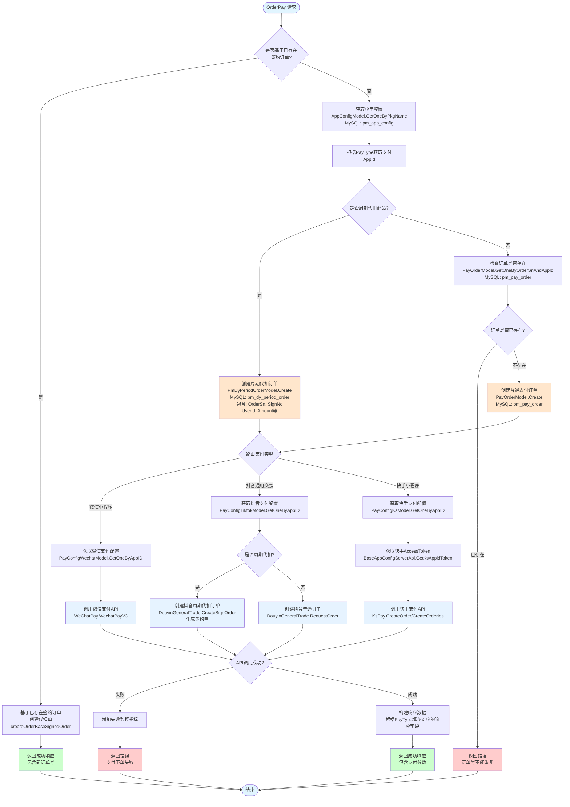

**关键特性**：
- 支持基于已存在签约订单创建代扣单（`IsBaseExistSignedOrder`）
- 支持周期代扣订单（`IsPeriodProduct`），使用 `pm_dy_period_order` 表
- 周期代扣订单自动生成 `SignNo`（签约单号）= `OrderSn` + "0"
- 快手支付区分 iOS 和 Android，调用不同的 API

#### 3.3.2 OrderStatus - 查询订单状态（gRPC）

**接口定义**：
```protobuf
rpc OrderStatus(OrderStatusReq) returns(OrderStatusResp);
```

**请求参数 (OrderStatusReq)**：
- `OrderSn`: 商户订单号
- `PayType`: 支付方式（微信、抖音、快手等）
- `AppPkgName`: 应用包名

**响应参数 (OrderStatusResp)**：
- `OrderSn`: 商户订单号
- `Status`: 支付状态（1支付成功，0其他）
- `PayAmount`: 支付金额（单位：分）
- `ThirdRespJson`: 第三方支付请求返回 JSON

**处理流程**：

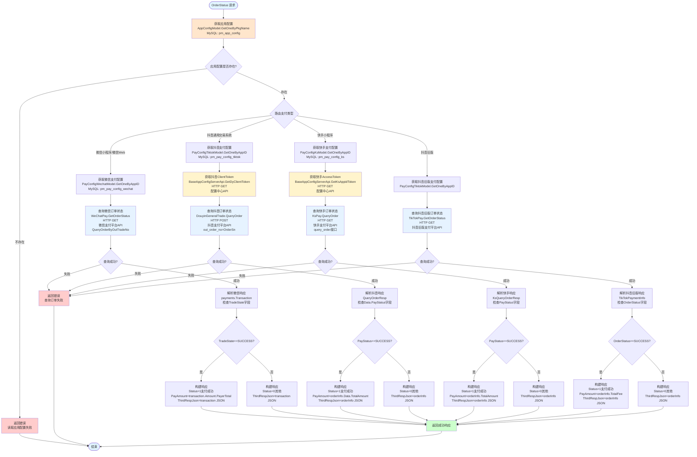

**关键特性**：
- **微信支付状态判断**：检查 `TradeState` 字段，值为 "SUCCESS" 表示支付成功
- **抖音支付状态判断**：检查 `Data.PayStatus` 字段，值为 "SUCCESS" 表示支付成功
- **快手支付状态判断**：检查 `PayStatus` 字段，值为 "SUCCESS" 表示支付成功
- **抖音旧版支付状态判断**：检查 `OrderStatus` 字段，值为 "SUCCESS" 表示支付成功
- **Token 获取**：抖音和快手需要先获取 AccessToken/ClientToken，然后才能查询订单状态
- **完整响应返回**：将第三方支付平台的完整响应 JSON 返回给调用方，便于排查问题

**微信支付状态枚举**（TradeState）：
- `SUCCESS`: 支付成功
- `REFUND`: 转入退款
- `NOTPAY`: 未支付
- `CLOSED`: 已关闭
- `REVOKED`: 已撤销（仅付款码支付会返回）
- `USERPAYING`: 用户支付中（仅付款码支付会返回）
- `PAYERROR`: 支付失败（仅付款码支付会返回）

#### 3.3.3 DouyinPeriodOrder - 抖音周期代扣管理（gRPC）

**接口定义**：
```protobuf
rpc DouyinPeriodOrder(DouyinPeriodOrderReq) returns(DouyinPeriodOrderResp);
```

**支持的操作类型 (Action)**：
- `DyPeriodActionQuery`: 查询单个签约情况
- `DyPeriodActionCancel`: 用户发起解约
- `DyPeriodActionGetPayList`: 获取今日可以扣款的签约订单信息
- `DyPeriodActionUpdateNextTime`: 更新下一期抖音签约代扣扣款时间

**处理流程**：

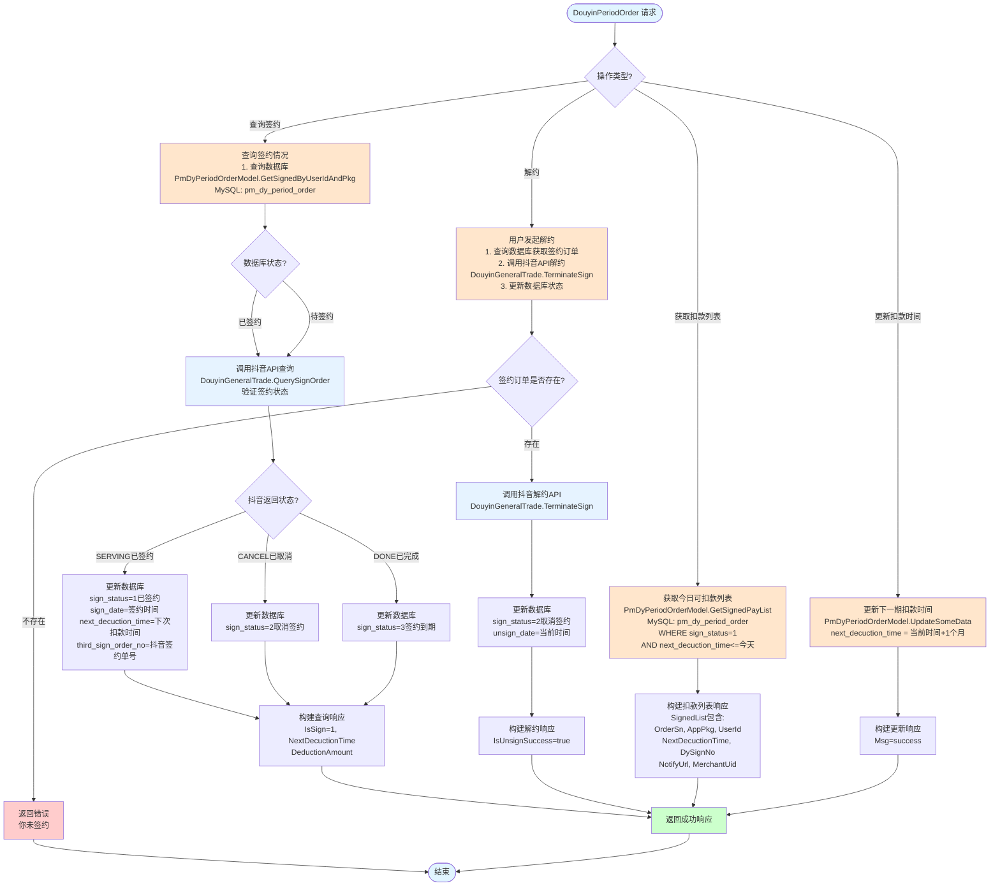

#### 3.3.3 NotifyDouyin - 抖音支付回调（HTTP API）

**接口路径**：`POST /notify/douyin`

**处理流程**：

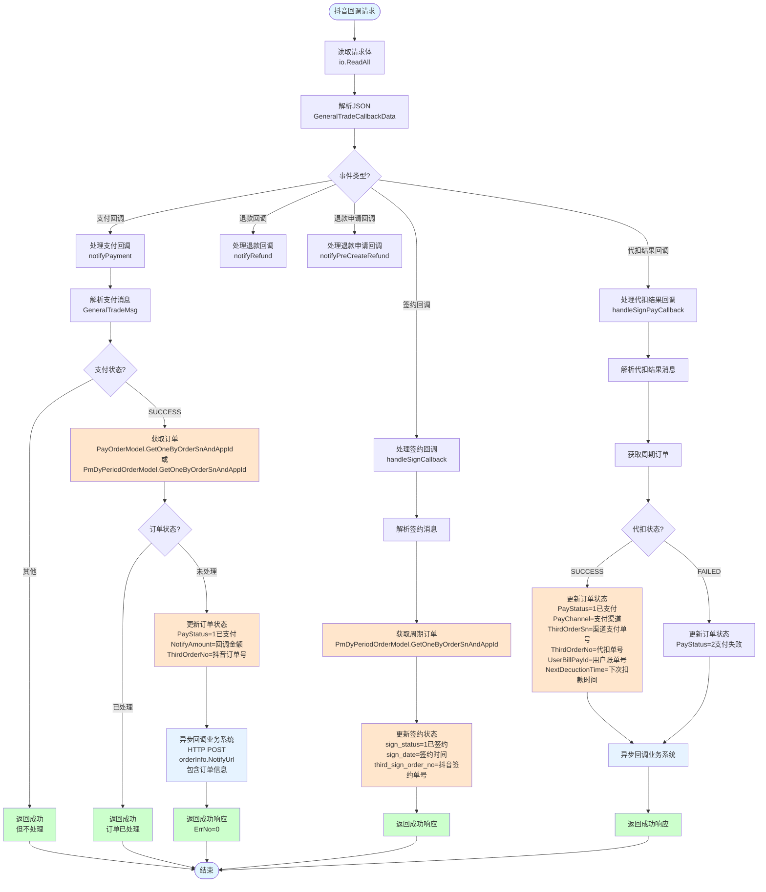

**支持的事件类型**：
- `EventPayment`: 支付回调
- `EventRefund`: 退款回调
- `EventSettle`: 结算回调（未接入）
- `EventPreCreateRefund`: 退款申请回调
- `EventSignCallback`: 抖音周期代扣签约回调
- `EventSignPayCallback`: 抖音周期代扣结果回调通知
- `EventSignRefundNotify`: 签约退款通知

#### 3.3.4 NotifyWechat - 微信支付回调（HTTP API）

**接口路径**：`POST /notify/wechat`

**处理流程**：

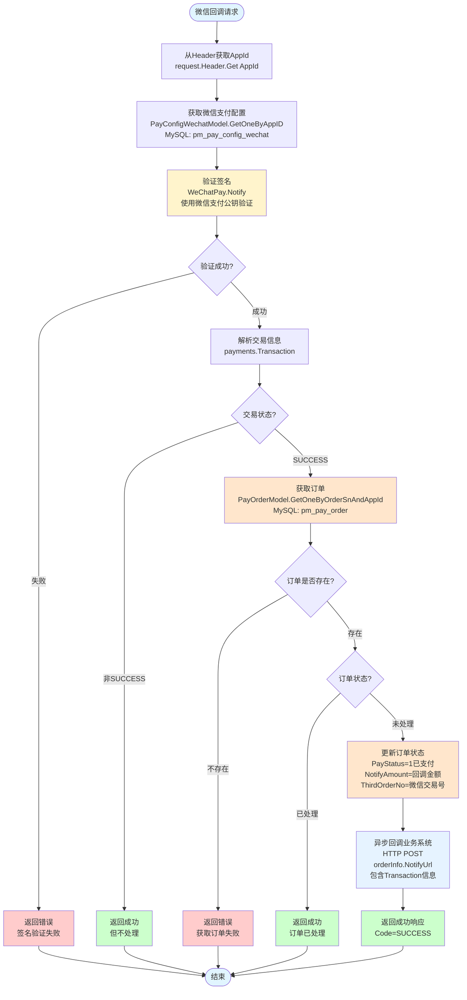

## 4. 数据模型

### 4.1 数据库表结构

#### 4.1.1 pm_pay_order 表（支付订单表）

与 pay-gateway-rpc 相同，参考 pay-gateway-rpc-architecture.md。

#### 4.1.2 pm_dy_period_order 表（抖音周期代扣订单表）

| 字段名 | 类型 | 说明 |
|--------|------|------|
| id | int | 主键ID |
| order_sn | varchar(64) | 内部订单唯一标识（开发者侧代扣单的单号） |
| sign_no | varchar(64) | 内部签约单号（开发者侧签约单号，= order_sn + "0"） |
| app_pkg_name | varchar(64) | 来源包名 |
| user_id | int | 内部用户id |
| amount | int | 订单金额（单位：分） |
| notify_amount | int | 回调金额（单位：分） |
| subject | varchar(256) | 订单标题 |
| pay_type | int | 支付方式 |
| notify_url | varchar(512) | 回调通知地址 |
| pay_status | int | 支付状态（0未支付，1已支付，2支付失败） |
| pay_channel | int | 支付渠道（扣款成功时才有） |
| sign_status | int | 签约状态（0待签约，1已签约，2取消签约，3签约到期） |
| pay_app_id | varchar(64) | 第三方支付的appid |
| third_order_sn | varchar(64) | 抖音平台返回的渠道支付单号 |
| third_order_no | varchar(64) | 抖音平台返回的代扣单的单号 |
| third_sign_order_no | varchar(64) | 抖音平台返回的签约单号 |
| currency | varchar(16) | 支付币种 |
| user_bill_pay_id | varchar(64) | 用户抖音交易单号（账单号） |
| sign_date | datetime | 签约时间（默认值2000-01-01 00:00:01） |
| unsign_date | datetime | 解约时间（默认值2000-01-01 00:00:01） |
| expire_date | datetime | 签约到期时间（默认值2000-01-01 00:00:01） |
| next_decuction_time | datetime | 下次扣款时间（默认值2000-01-01 00:00:01） |
| dy_product_id | varchar(64) | 抖音商品id |
| nth_num | int | 第几期代扣单 |

**签约状态枚举**：
- `Sign_Status_Wait` (0): 等待签约
- `Sign_Status_Success` (1): 签约成功
- `Sign_Status_Cancel` (2): 取消签约
- `Sign_Status_Done` (3): 签约到期（服务已完成）

## 5. 调用流程

### 5.1 业务系统调用 gRPC 接口流程

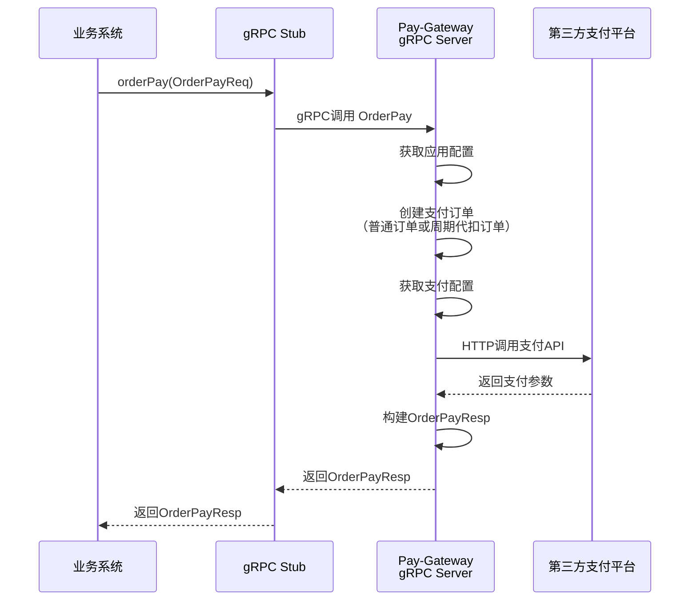

### 5.2 支付回调流程

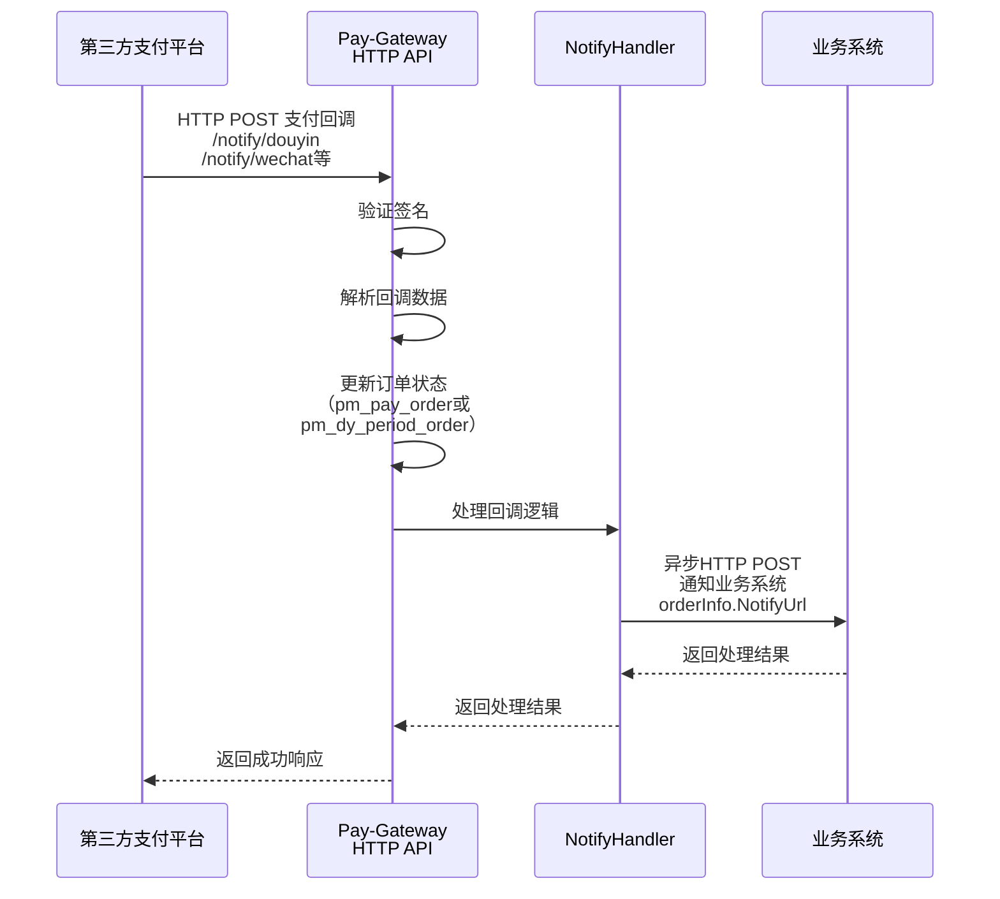

### 5.3 周期代扣完整流程

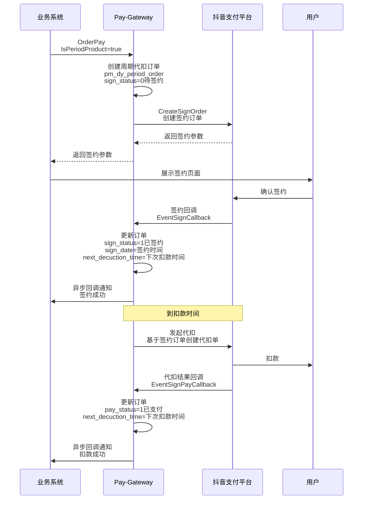

## 6. 关键特性

### 6.1 周期代扣订单管理

- **签约单号生成规则**：`SignNo` = `OrderSn` + "0"
- **签约状态管理**：支持待签约、已签约、取消签约、签约到期四种状态
- **扣款时间管理**：自动计算下次扣款时间（签约时间 + 1个月）
- **基于已存在签约订单创建代扣单**：支持 `IsBaseExistSignedOrder` 参数

### 6.2 回调处理

- **签名验证**：所有回调都进行签名验证
- **幂等性处理**：通过订单状态判断，避免重复处理
- **异步回调业务系统**：使用 goroutine 异步通知业务系统
- **监控指标**：`CallbackBizFailNum`（回调业务异常）、`CallbackRefundFailNum`（回调退款异常）

### 6.3 配置管理

- 应用配置：通过 `pm_app_config` 表管理每个包名对应的支付AppID
- 支付配置：通过 `pm_pay_config_*` 表管理各支付平台的详细配置
- 支持多包名、多支付方式的灵活配置

### 6.4 监控指标

**RPC 接口监控**：
- `wechatUniPayFailNum`: 微信支付下单失败次数
- `tiktokEcPayFailNum`: 抖音支付下单失败次数
- `ksPayFailNum`: 快手支付下单失败次数
- `alipayWapPayFailNum`: 支付宝支付下单失败次数
- `orderTableIOFailNum`: 订单表IO失败次数

**API 回调监控**：
- `CallbackBizFailNum`: 网关回调业务异常
- `CallbackRefundFailNum`: 网关回调退款业务异常
- `notifyOrderHasDispose`: 回调订单已处理

## 7. 部署架构

### 7.1 服务部署

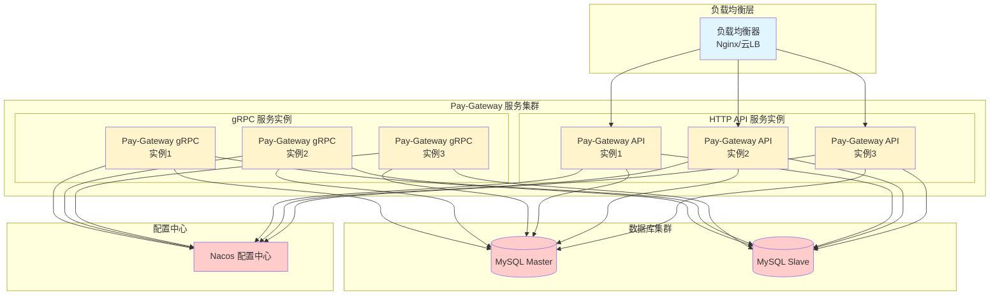

### 7.2 服务发现

- 使用 Nacos 作为服务注册中心
- gRPC 服务通过 Nacos 注册，业务系统通过 Nacos 发现服务
- HTTP API 服务通过 Nacos 注册，支持负载均衡

## 8. 安全机制

### 8.1 签名验证

- **微信支付**：使用微信支付公钥验证回调签名
- **抖音支付**：使用平台公钥验证回调签名（Byte-Authorization）
- **快手支付**：使用 MD5 验证回调签名
- **支付宝**：使用支付宝公钥验证回调签名

### 8.2 回调验证

- 验证回调请求的签名
- 确保回调来源的合法性
- 防止重放攻击
- 订单状态检查，避免重复处理

### 8.3 配置安全

- 支付密钥存储在数据库中，不暴露在代码中
- 支持密钥版本管理
- 定期轮换密钥

## 9. 性能优化

### 9.1 数据库优化

- 订单表使用 `order_sn` 和 `pay_app_id` 联合索引
- 周期代扣订单表使用 `user_id` 和 `app_pkg_name` 联合索引
- 配置表使用 `app_id` 或 `pkg_name` 唯一索引
- 支持读写分离（Master-Slave）

### 9.2 连接池

- gRPC 连接复用
- HTTP 客户端连接池
- 数据库连接池

### 9.3 缓存策略

- 应用配置缓存（减少数据库查询）
- 支付配置缓存（减少数据库查询）

### 9.4 异步处理

- 回调业务系统使用 goroutine 异步处理
- 避免阻塞回调响应

## 10. 监控和告警

### 10.1 监控指标

- **接口调用量**：各接口的调用次数
- **接口成功率**：各接口的成功率
- **接口耗时**：各接口的响应时间
- **支付失败数**：各支付方式的失败次数
- **数据库IO失败数**：数据库操作的失败次数
- **回调业务失败数**：回调业务系统的失败次数

### 10.2 告警规则

- 支付失败率超过阈值
- 接口响应时间超过阈值
- 数据库连接失败
- 第三方API调用失败率过高
- 回调业务系统失败率过高

## 11. 扩展性

### 11.1 新增支付方式

1. 在 `payment.proto` 中添加新的 `PayType` 枚举值
2. 实现新的支付客户端（继承或参考现有客户端）
3. 在 `OrderPayLogic` 中添加路由逻辑
4. 添加对应的配置表（如 `pm_pay_config_xxx`）
5. 更新应用配置表，添加新的 AppID 字段
6. 添加对应的回调处理逻辑（如 `NotifyXxxLogic`）

### 11.2 水平扩展

- 支持多实例部署
- 通过负载均衡分发请求
- 无状态设计，易于扩展

## 12. 故障处理

### 12.1 常见问题

1. **配置不存在**：检查 `pm_app_config` 和 `pm_pay_config_*` 表
2. **签名失败**：检查密钥配置和签名算法
3. **订单重复**：检查订单号生成逻辑
4. **回调失败**：检查回调地址和网络连通性
5. **周期代扣签约失败**：检查抖音商品配置和用户信息

### 12.2 降级策略

- 支付API调用失败时，返回明确错误信息
- 配置获取失败时，使用默认配置（如果支持）
- 数据库连接失败时，记录日志并返回错误
- 回调业务系统失败时，记录日志并增加监控指标

## 13. 版本历史

- **当前版本**：支持微信、抖音、快手、支付宝支付
- 支持周期代扣
- 支持退款功能
- 支持订单状态查询
- 支持完整的回调处理

## 14. 相关文档

- [gRPC 接口定义](../pay-gateway/rpc/protofile/payment.proto)
- [HTTP API 路由定义](../pay-gateway/api/internal/handler/routes.go)
- [Java 调用示例](../src/main/java/com/muchcloud/order/service/impl/PaymentRpcServiceImpl.java)
- [Go 实现代码](../pay-gateway/rpc/internal/logic/orderpaylogic.go)
- [回调处理代码](../pay-gateway/api/internal/logic/notify/notifydouyinlogic.go)
